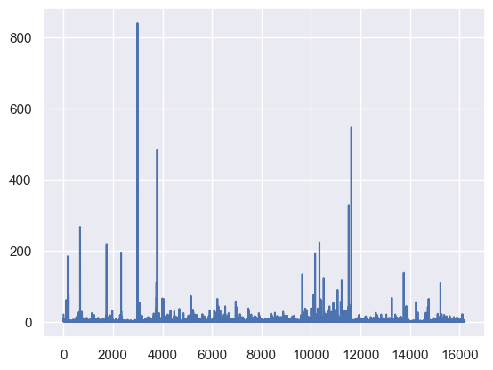

Ngram_range = (1,1)

Samples = 40000

Distribution 

Clusters left 16219

Score samples = 5000

- Silhouette Score: 0.3714598392780462
- Calinski-Harabasz Index: 531.2487680337874
- Davies-Bouldin Index: 0.3510776700047736